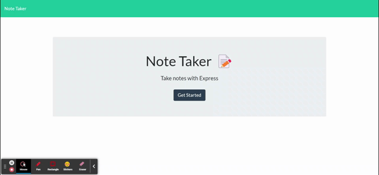

  # Digital Note Taker
  

  ## Description
  This project allows users to post, save, and delete notes using Express.js.
  
  Front-end code already existed; I developed back-end code to facilitate front-end functionality.

  ## Installation 
  To use locally, clone the repo, run `npm install` to install necessary packages. Then, from the command line, run `node server` and `localhost:3001` to open application. Alternatively, you can use the application online since it is deployed via heroku.

  Link to Github Repo: [https://github.com/krissmith7/note-taker](https://github.com/krissmith7/note-taker)

Link to Deployed Application: [https://digitalnote-taker.herokuapp.com](https://digitalnote-taker.herokuapp.com)

  ## Usage
   Below is a demo of the application in use.

  

  ## Questions
  Contact the developer with any questions!
 

